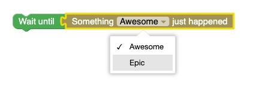

# better-blockly

A fully typesafe builder utility for defining Blockly blocks and implementaions in the same place with a focus on DX and type saftey.

## Usage

```ts
// src/blocks/std.ts

import { createBlockBuilder } from "better-blockly";

// you can also just roll your own base generator 
import pythonGenerator from "blockly/python"; 

const block = createBlockBuilder({
  generator: pythonGenerator,
  customTypes: ["event"],
});

block("something_did_happen")
  .hue(40)
  .outputs("event")
  .content((view) =>
    view
      .text("Something")
      .dropdown("THING", ["Awesome", "Epic"])
      .text("just happened"),
  )
  .impl((block) => `Events.${block.fields.THING}Thing`);

block("wait_for_event")
  .hue(120)
  .extern()
  .slot("target", {
    allow: "event",
    content: (view) => view.text("Wait"),
  })
  .impl((block) => `thread.wait_for_event(${block.resolve("target")})`);

```

then, in your application make sure to just `import 'src/blocks/std.ts';` to load the blocks and voila!

<p align="center">
    
</p>

This bit of blockly resolves to `"thread.wait_for_event(Events.AwesomeThing)"`

